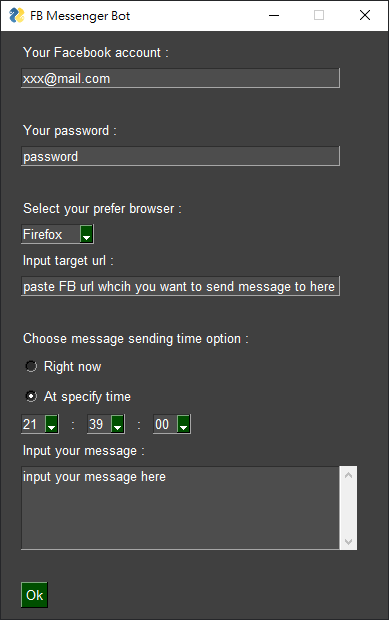

# Facebook Messenger bot

A Facebook Messenger bot written in Python3 with Selenium module that can send text or any other contents to specified user or fans club at desired time.

## Screenshot 🖥

## Warning ⚠

- This is not an official API, for that please visit [here](https://developers.facebook.com/docs/messenger-platform) for Facebook -chat bots.
- The script in this project **may violate Facebook's Terms of Service** (using Selenium module to crawl Facebook website elements) so better create a new fb account, use it as login account in the script.

## To-Do List 📋

- [x] Can login FB
- [x] Can send message to specified user or fans club right after user press Ok button (Right now option)
- [x] Create GUI for better user experience
- [x] Remember user login information (saved as json at local directory)
- [ ] Make the script be executable and portable so the people who are not familiar with Python can also use it easily
- [ ] Rearrange the process of messenger bot to minimize the time delay between user desired time and actually the time that texts are sent (important)
- [ ] Time scheduling option

## Requirement packages

TODO

## How to use 🔰

TODO
